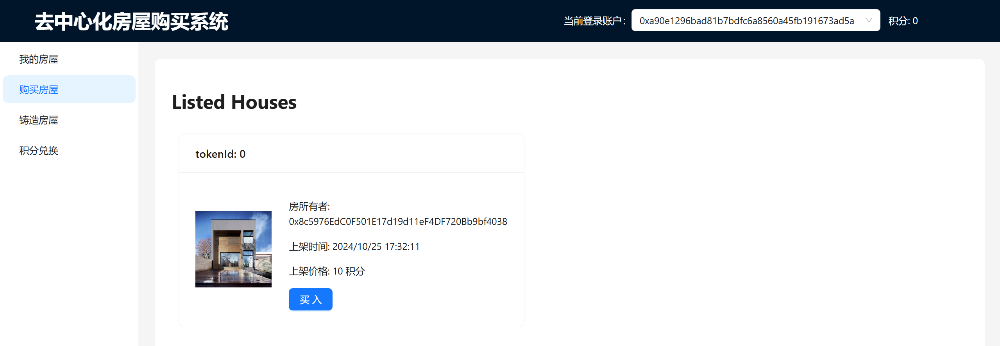

# ZJU-blockchain-course-2024


## 一、项目介绍

本项目是去中心化房屋购买系统，该系统建立在以太坊区块链上，利用智能合约确保每笔交易的透明度、安全性和效率。该系统的参与方包括：房屋拥有者，有购买房屋需求的用户。该系统的主要功能如下：

- 合约部署者可以为自己或者其他的普通账户铸造房屋
- 用户可以查看自己拥有的房产列表。并可以挂单出售自己的房屋（挂单包含价格等信息）
- 用户可以查看所有出售中的房产，可以选择支付相应价格购买某个其他用户出售的房产
- 当房屋出售成功后，合约部署者将收取一定比例的用户支付的费用，作为平台手续费
- 用户可以将测试以太币兑换成ERC20积分，并使用ERC20积分完成购买房屋（bonus部分）


## 二、功能实现分析

在本次项目中，实现了两个合约：BuyMyRoom（ERC721）和 ERCPoint（ERC20）。

- BuyMyRoom合约中记录了房子的状态信息，包括每个房子的 tokenId 号，所有者地址，是否上架，以及上架的价格和时间（如果有）。该合约还实现了铸造房屋、查看房屋信息、上架下架房屋、使用 ETH 或者 ERC20 积分购买房屋的相关操作，是整个系统的核心逻辑处理。

  ```c++
  contract BuyMyRoom is ERC721 {
      // 上架、下架、出售（购买）房屋事件
      event HouseList(uint256 tokenId, uint256 price, address owner);
      event HouseDelist(uint256 tokenId, address owner);
      event HouseSell(uint256 tokenId, uint256 price, address seller, address buyer);
      
      // 房屋结构体
      struct House {
          uint256 tokenId;
          address owner;
          bool isListed;
          uint256 listedTimestamp;
          uint256 price;
      }
      
      address private deployer;           // 合约部署者
      uint256 private allocatedId = 0；   // 分配给房子的Id，自增
      mapping(uint256 => House) public houses; // token -> House 映射表

      uint256 private feeRate = 1; // 手续费比例 1‰
      ERCPoint public ercPoint;    // 积分合约

      constructor() ERC721("BuyMyRoom", "BYMR") {
          deployer = msg.sender; // 合约部署者初始化
          ercPoint = new ERCPoint();
      }

      // 合约部署者铸造房屋
      function createHouse(address owner) public returns(uint256);
      // 获取我的房屋列表、获取已上架房屋列表
      function getMyHouses() public view returns(House[] memory);
      function getHousesListed() public view returns(House[] memory);
      // 上架、下架房屋
      function listHouse(uint256 tokenId, uint256 price) public;
      function delistHouse(uint256 tokenId) public;
      // 购买房屋（使用ETH）
      function buyHouse(uint256 tokenId) public payable;
      // 购买房屋(使用ERCPoint代币)
      function buyHouseWithPoint(uint256 tokenId) public;
  }
  ```


- ERCPoint 合约实现了ERC20积分与 ETH 的兑换服务，还提供了查看积分数的接口。

  ```c++
  contract ERCPoint is ERC20 {
  	// ERC20 积分与 ETH 兑换事件
      event evEthToPoints(address buyer, uint256 eth);
      event evPointsToEth(address buyer, uint256 points);
      
      address private deployer;
      constructor() ERC20("ERCPoint", "EPT") {
          deployer = msg.sender;
      }
      
  	// 获取我的积分
      function getMyPoints() public view returns (uint256);
  	// ETH 兑换积分
      function EthToPoints() public payable;
  	// 积分换回 ETH
      function PointsToEth(uint256 points) public;
  }
  ```

上面是大致的合约函数组织，下面分别介绍它们的实现：

#### 1. 合约部署者为用户铸造房屋

该函数接受一个owner参数，表示将要分配给的用户。首先用require判断消息传输者是不是合约部署者，如果不是返回“No deployer”。然后 allocatedId自增，并将房屋信息存在houses映射表中。这里还调用了ERC721合约的_safeMint，将一个NFT代币从一个零地址（表示尚未被创建）转移到另一个地址（即用户地址owner）

```c++
function createHouse(address owner) public returns(uint256) {
    require(deployer == msg.sender, "No deployer");
    uint256 newId = allocatedId ++;
    _safeMint(owner, newId);
    houses[newId] = House({
        tokenId: newId, owner: owner, isListed: false, listedTimestamp: 0, price: 0
    });
    return newId;
}
```

#### 2. 查看个人房屋列表、上架房屋列表 

**getMyHouses**：查看个人房屋列表。该函数返回请求者msg.sender的房屋信息。首先遍历一遍houses计算一共有多少个房子属于msg.sender，然后根据刚才计算出的count开辟一定空间，再次遍历houses以存储这些房屋信息，最后以House数组的形式将个人房屋列表返回给用户。

```c++
function getMyHouses() public view returns(House[] memory) {
    uint count = 0;
    for (uint i = 0; i < allocatedId; i++) {
        if (houses[i].owner == msg.sender) count++;
    }
    uint counter = 0;
    House[] memory myhouses = new House[](count);
    for (uint i = 0; i < allocatedId; i++) {
        if (houses[i].owner == msg.sender) {
            myhouses[counter++] = House({
                tokenId: houses[i].tokenId,
                owner: houses[i].owner,
                isListed: houses[i].isListed,
                listedTimestamp: houses[i].listedTimestamp,
                price: houses[i].price
            });
        }
    }
    return myhouses;
}
```

**getHousesListed**：查看已经上架的房屋列表。首先遍历一遍houses计算一共有多少个房子已经上架（isListed == true），然后根据刚才计算出的count开辟一定空间，再次遍历houses以存储这些房屋信息，最后以House数组的形式将已经上架的房屋列表返回给用户。

```c++
function getHousesListed() public view returns(House[] memory) {
    uint count = 0;
    for (uint i = 0; i < allocatedId; i++) {
        if (houses[i].isListed) count++;
    }
    uint counter = 0;
    House[] memory listedhouses = new House[](count);
    for (uint i = 0; i < allocatedId; i++) {
        if (houses[i].isListed) {
            listedhouses[counter++] = House({
                tokenId: houses[i].tokenId,
                owner: houses[i].owner,
                isListed: houses[i].isListed,
                listedTimestamp: houses[i].listedTimestamp,
                price: houses[i].price
            });
        }
    }
    return listedhouses;
}
```

#### 3. 用户上架、下架房屋

**listHouse**：上架房屋。该函数接受 tokenId（想上架房屋tokenId）price（房屋价格）。更新 houses[tokenId] 的内容即可，主要是修改上架状态 isListed 为 true，修改上架时间（采用 block.timestamp）和上架价格。

**delistHouse**：下架房屋。该函数接受 tokenId（想下架的房屋tokenId）。更新 houses[tokenId] 的内容即可，主要是修改上架状态 isListed 为 false。

```c++
// 上架房屋
function listHouse(uint256 tokenId, uint256 price) public {
    require(houses[tokenId].owner == msg.sender, "You are not the owner of this house");
    houses[tokenId].price = price;
    houses[tokenId].isListed = true;
    houses[tokenId].listedTimestamp = block.timestamp;
    emit HouseList(tokenId, price, msg.sender);
}
// 下架房屋
function delistHouse(uint256 tokenId) public {
    require(houses[tokenId].owner == msg.sender, "You are not the owner of this house");
    houses[tokenId].price = 0;
    houses[tokenId].isListed = false;
    houses[tokenId].listedTimestamp = 0;
    emit HouseDelist(tokenId, msg.sender);
}
```

#### 4. 用户使用ETH购买房屋

**buyHouse**：使用ETH购买房屋。由于该函数涉及到以太币交易，因此需要加上关键字 payable。函数通过 `tokenId` 参数接收要购买的房屋的ID，并期望调用者（买家）发送足够的以太币（msg.value）来完成购买。

在函数内部，首先获取房屋的价格和卖家地址。然后，根据房屋上架时间计算平台的交易费用，确保费用不会超过房屋价格。接着，计算卖家应收到的金额，即房屋价格减去交易费用。所有权转移通过调用 `_transfer` 函数实现，将房屋从卖家转移到买家。然后，使用 `payable` 地址和 `transfer` 方法将卖家应得的金额和平台费用分别发送到卖家和合约部署者的以太坊地址。随后，更新房屋的状态，将所有者设置为买家，将房屋标记为未上架，并重置上架时间和价格。最后，触发 `HouseSell` 事件，记录房屋的销售信息，包括房屋ID、价格、卖家和买家地址。

```c++
function buyHouse(uint256 tokenId) public payable {
    uint256 price = houses[tokenId].price;
    address seller = houses[tokenId].owner;

    uint256 fee = (block.timestamp - houses[tokenId].listedTimestamp) * feeRate * price / 1000;
    if (fee > price) fee = price;
    uint256 amount = price - fee;

    // 所有权转移
    _transfer(seller, msg.sender, tokenId);
    // 支付
    payable(seller).transfer(amount * 1 ether);
    payable(deployer).transfer(fee * 1 ether);

    houses[tokenId].owner = msg.sender;
    houses[tokenId].isListed = false;
    houses[tokenId].listedTimestamp = 0;
    houses[tokenId].price = 0;

    emit HouseSell(tokenId, price, seller, msg.sender);
}
```

#### 5. ERC20积分与ETH的兑换

**EthToPoints**：ETH 兑换积分。

调用者发送以太币到合约时，会触发这个函数。函数内部首先计算转换的积分数量，由于1以太币等于1积分，所以积分数量等于发送的以太币数量（`msg.value`）除以1以太币（`1 ether`）。接下来，使用 `_mint` 方法铸造相应数量的积分给调用者（`msg.sender`），从而增加了调用者的积分余额。最后，触发 `evEthToPoints` 的事件，记录了积分转换的相关信息，包括转换者的地址和转换得到的积分数量。

**PointsToEth**：积分换回 ETH。

函数内部首先调用 `_burn` 方法销毁调用者指定数量的积分，减少了调用者的积分余额。然后，使用 `transfer` 方法将等量的以太币发送给调用者，即1积分兑换1以太币。最后，触发 `evPointsToEth` 的事件，记录了积分兑换以太币的相关信息，包括兑换者的地址和兑换的积分数量。

```c++
function EthToPoints() public payable {
    // 1 eth => 1 points
    uint256 points = msg.value / 1 ether;
    _mint(msg.sender, points);
    emit evEthToPoints(msg.sender, points);
}

function PointsToEth(uint256 points) public {
    // 1 points => 1 eth
    _burn(msg.sender, points);
    payable(msg.sender).transfer(points * 1 ether);
    emit evPointsToEth(msg.sender, points);
}
```

#### 6. 使用ERC20积分购买房屋

首先确定房屋的价格和当前所有者（seller），然后根据房屋上架时间计算出手续费，手续费上限是price。接着，计算卖家实际应得的金额（amount=price-fee），并通过调用ERC20积分合约的 `transferFrom` 方法，从买家的账户中转移相应数量的积分给卖家和合约部署者（作为平台费用）。随后，调用 `_transfer` 方法更新房屋的所有权，将房屋从卖家转移到买家，并标记房屋为未上架状态，重置上架时间和价格。最后，触发 `HouseSell` 事件，记录下这次房屋销售的详细信息，包括房屋ID、价格、卖家和买家的地址。

```c++
function buyHouseWithPoint(uint256 tokenId) public {
    uint256 price = houses[tokenId].price;
    address seller = houses[tokenId].owner;

    uint256 fee = (block.timestamp - houses[tokenId].listedTimestamp) * feeRate * price / 1000;
    if (fee > price) fee = price;
    uint256 amount = price - fee;

    // 所有权转移
    _transfer(seller, msg.sender, tokenId);
    // 支付
    ercPoint.transferFrom(msg.sender, seller, amount);
    ercPoint.transferFrom(msg.sender, deployer, fee);

    houses[tokenId].owner = msg.sender;
    houses[tokenId].isListed = false;
    houses[tokenId].listedTimestamp = 0;
    houses[tokenId].price = 0;

    emit HouseSell(tokenId, price, seller, msg.sender);
}
```


## 三、项目运行方法

补充如何完整运行你的应用。

1. 确保相关工具链已经安装，在本地启动ganache应用。

2. 在 `./contracts` 中安装需要的依赖，运行如下命令：
    ```shell
    npm install
    ```

3. 在 `./contracts/hardhat.config.ts` 中，将 accounts 修改为对应ganache账户私钥

4. 在 `./contracts` 中编译合约，运行如下命令：

    ```shell
    npx hardhat compile
    ```

5. 在 `./contracts` 中将合约部署到 ganache，运行如下命令：

    ```shell
    npx hardhat run ./scripts/deploy.ts --network ganache
    ```

    这样之后将会得到两个地址，一个是 `BuyMyRoom` 合约部署地址、一个是其中的 `ERCPoint` 合约部署地址。

6. 将 `./frontend/src/utils` 的 `contract-addresses.json` 的两个值分别改为上述步骤的两个地址；

    将 `./frontend/src/utils/abis` 的两个json文件替换为 `./contracts/artifacts/contracts` 下的 `BuyMyRoom.json` 和 `ERCPoint.json`

7. 在 `./frontend` 中安装需要的依赖，运行如下的命令：

    ```bash
    npm install
    ```

7. 在 `./frontend` 中启动前端程序，运行如下的命令：
    ```bash
    npm run start
    ```


## 四、项目运行截图

完成上述运行命令后，打开浏览器（已下载MetaMask），访问 localhost:3000，如下：


登录后，若连接成功，“当前登录账户“显示的就是我们的合约部署者（accounts[0]）：


#### 1. 合约部署者为用户铸造房屋 

当前账户是合约部署者，可以铸造使用该账户来铸造房屋，点击铸造房屋，挑选其中一个账户铸造房屋，例如下图操纵合约部署者对账户 0x8c5976EdC0F501E17d19d11eF4DF720Bb9bf4038 创建房子，点击创建房屋后，会弹出 MetaMask框，都点击确定即可，最后能看到创建成功信息提示：


#### 2. 查看房屋列表、上架下架房屋 

切换账户 0x8c5976EdC0F501E17d19d11eF4DF720Bb9bf4038，可以看到该账户名下有一个房子，暂未上架：


在该账户下，上架这个 tokenId为0的房子，以10为价格上传，结果显示上架成功，并更新了房屋信息：


点击购买房屋，查看房屋列表，可以看到刚才上架的房屋已经添加到购买房屋列表之中：



#### 3. ETH 和 ERC20 积分兑换

由于我的系统只允许使用积分进行买卖，所以在开始购买之前，先展示兑换一定积分。先切换为其他账户，例下图 0xa90E1296BAd81b7BdfC6a8560a45FB191673ad5A。在”积分兑换“菜单中，利用20ETH兑换20点积分：


点击兑换按钮后，进行确定，可以看到兑换成功信息，而且右上角的积分点数改为了20；查看ganache，也会发现 0xa90E1296BAd81b7BdfC6a8560a45FB191673ad5A 的 balance 减少了 20ETH，结果符合预期。


现在尝试出售积分，也就是将积分换为对应的eth。点击出售积分，输入要卖出的积分数，系统会自动计算出能得到的eth数。点击卖出，可以看到出售成功信息，右上角的积分数改为了15，ganache余额增加 5ETH。


#### 4. 房屋的买卖

点击购买房屋，选择tokenId为0的房屋进行买入，弹出的MetaMask都点击确定：


最后会发现购买成功，刚才购买的房屋消失在列表中，在自己的房屋中可以看到tokenId为0的房屋（处于未上架状态）；而且由于刚才买房子花了10积分，右上角积分数会从15减少到5（而且还会发现卖家的积分数增加5）：


## 参考内容

- 课程的参考Demo：[DEMOs](https://github.com/LBruyne/blockchain-course-demos)。
- 快速实现 ERC721 和 ERC20：[模版](https://wizard.openzeppelin.com/#erc20)。
- 如何实现ETH和ERC20的兑换：[参考讲解](https://www.wtf.academy/en/docs/solidity-103/DEX/)

